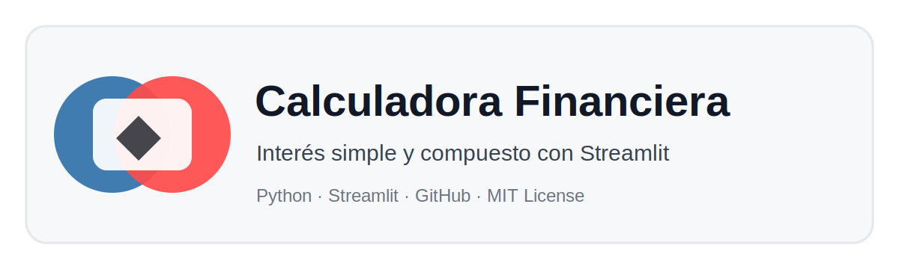

# Calculadora de Interés Simple y Compuesto




## Objetivo

Construir una aplicación básica con Streamlit para calcular **interés simple** e **interés compuesto**.  
Este proyecto permite practicar:

- Creación de formularios con `st.sidebar`.
- Uso de `selectbox`, `number_input`, métricas y tablas.
- Visualización de resultados con Plotly.
- Organización profesional de un repositorio en GitHub.
- Despliegue en Streamlit Community Cloud.

## Estructura del proyecto

```text
01_calculadora_interes_streamlit/
├── app.py
├── requirements.txt
├── README.md
├── LICENSE
├── .gitignore
├── .streamlit/
│   └── config.toml
└── assets/
    └── banner.svg
```

## Ejecutar localmente

```bash
python -m venv .venv
.venv\Scripts\activate
pip install -r requirements.txt
streamlit run app.py
```

En Mac/Linux:

```bash
python3 -m venv .venv
source .venv/bin/activate
pip install -r requirements.txt
streamlit run app.py
```

## Despliegue sugerido

1. Crear un repositorio público en GitHub.
2. Subir todos los archivos de esta carpeta.
3. Verificar que existan `app.py`, `requirements.txt`, `README.md` y `LICENSE`.
4. Ingresar a Streamlit Community Cloud.
5. Crear una nueva app conectando el repositorio.
6. Seleccionar el archivo principal: `app.py`.
7. Desplegar.

## Licencia

Este proyecto usa licencia MIT. El estudiante debe reemplazar el nombre del autor si desea personalizarla.
